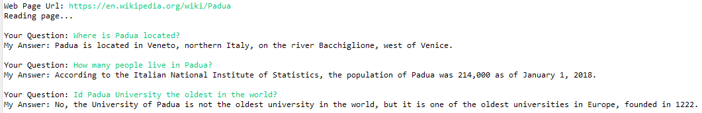

# predictive-powers

`predictive-powers` is library to make generative AI (easily?) accessible to Java developers.

Currently the library:

  1. Provides low-level access to OpeanAi API similar to [OpenAI-Java](https://github.com/TheoKanning/openai-java). It adds access to audio API which, at the time of writing (May 2023) is not supported by OpenAI-Java (and [not really working](https://community.openai.com/t/whisper-api-cannot-read-files-correctly/93420) TBH).
  
  2. Adds an abstraction layer to GenAI capabilities, which should allow in the future to plug-in different providers (e.g. Hugging Face) seamlessly.
  
  3. Provides a in-memory vector database and methods to easily process and embed files in different formats (MS Office, PDF, HTML, etc., courtesy of [Apache Tika](https://tika.apache.org/)). Again, plans are to make this DB agnostic and add support for the most commmon vector databases.
  
## Installation

This library depends, among others, on Jackson [data-binding](https://github.com/FasterXML/jackson-databind) and [annotations](https://github.com/FasterXML/jackson-annotations), 
and on [Lomboc](https://projectlombok.org/) libraries.
  
These are correctly referenced within the `pom.xml` file for this project. However, to have Lomboc to work, you need to install it in Eclipse or any other IDE you are using, as explained on Lomboc website.
	
## Usage

### Direct OpenAi API calls

You can access OpeanAi API by instantiating an `OpenAiClient`. The constructor allows you to pass your OpenAi API key, which will be used in all subsequent calls. If you use the no-arguments constructor, the code will try to read the key from 'OPENAI_API_KEY' system environment variable.

After that, you can call OpenAi API directly; this part of code is not heavily documented but matches 1:1 [OpenAi documentation](https://platform.openai.com/docs/api-reference/introduction).

```java
import io.github.mzattera.predictivepowers.openai.client.OpenAiClient;
import io.github.mzattera.predictivepowers.openai.client.completions.CompletionsRequest;
import io.github.mzattera.predictivepowers.openai.client.completions.CompletionsResponse;

public class Test {

	public static void main(String[] args) {

		// Get API key from OS environment
		OpenAiClient cli = new OpenAiClient();

		// Complete a sentence.
		CompletionsRequest req = CompletionsRequest.builder()
			.model("text-davinci-003")
			.maxTokens(50)
			.prompt("Alan Turing was").build();
		CompletionsResponse resp = cli.createCompletion(req);

		System.out.println(resp.getChoices().get(0).getText());

	}

}
```

will output something like:

```console
 a British mathematician, computer scientist, logician, cryptanalyst, philosopher,
 and theoretical biologist who was highly influential in the development
 of theoretical computer science and artificial intelligence.
```

### Endpoint

An endpoint provides GenAI capabilities in form of services; it can be created similarly to an `OpenAiClient`, by passing an API key or reading it from the OS environment.
  
```java
import io.github.mzattera.predictivepowers.OpenAiEndpoint;
import io.github.mzattera.predictivepowers.openai.client.OpenAiClient;

[...]

	// Get API key from OS environment
	OpenAiEndpoint ep = OpenAiEndpoint.getInstance();

	// Pass API key explicitly
	ep = OpenAiEndpoint.getInstance();

	// Build it from an API client
	OpenAiClient cli = new OpenAiClient();
	ep = OpenAiEndpoint.getInstance(cli);
```

### Services

Once the endpoint is created, it can be used to access "services" which are high-level GenAI capabilities. Currently following services are provided:

  * `ChatService` handles conversations with an agent, taking care of agent personality and conversation history.
  * `CompletionService` text completion (including insertions): basically, it executes given text prompt.
  * `EmbeddingService` embeds text and calculate semantic similarity; it takes care of automatically splitting text when needed, or if desired.
  * `QuestionAnsweringService` answers questions, using a user-provided context. The context can be a knowledge base (see below).
  * `QuestionExtractionService` extracts different kinds od questions from a text (e.g. true/false question, multiple choices quizzes, etc.). It automatically handles long texts.
  
The below example shows how to get the `CompletionService` to complete a sentence.

```java
import io.github.mzattera.predictivepowers.OpenAiEndpoint;
import io.github.mzattera.predictivepowers.services.CompletionService;

public class TestEndpoint {

	public static void main(String[] args) {

		OpenAiEndpoint ep = OpenAiEndpoint.getInstance();
		CompletionService cs = ep.getCompletionService();

		System.out.println(cs.complete("Alan Turing was").getText());
	}
}
```

Below we provide some examples of using services; for a detailed description of the functionalities provided, please refer to the library JavaDoc.

#### Service Configuration
  
OpenAi provides a rich set of parameters for each of its API calls; in order to access these parameters services exposes a "default request" object.
This object is used when the service calls OpenAi API. Changing parameters on this object, will affect all further calls to the API.

 For example, let's assume we want to use `courie` model for text completion; we can change the above text as shown here:
 
 ```java
 import io.github.mzattera.predictivepowers.OpenAiEndpoint;
import io.github.mzattera.predictivepowers.services.CompletionService;

public class TestEndpoint {

	public static void main(String[] args) {

		OpenAiEndpoint ep = OpenAiEndpoint.getInstance();
		CompletionService cs = ep.getCompletionService();
		
		// Set model parameter in default request, this will affect all further calls		
		cs.getDefaultReq().setModel(" text-curie-001");

		// This call now uses text-curie-001 model
		System.out.println(cs.complete("Alan Turing was").getText());
	}
}
 ```
 
 ### Knowledge Base
 
 A knowledge base is a vector database storing text embedding; a number of arbitrary data (in the form of a map) can be attached to each embedding. 
 
 The knowledge base provides methods to search text, based on embedding similarity or other filt3ring criteria. Each knowledge base can be partitioned into domains, which can be searched separately, to improve performance.
 
 
 ### Thread Safety
 
 With the notable exception of the knowledge base, classes in this library are NOT thread safe; this is because the library is, at present, supporting a micro-service stateless architecture,
 where AI capabilities are provided at endpoints through REST API.
 
 This greatly simplifies server architecture and allows to scale applications automatically and effortlessly when deployed inside a cloud environment.
 
 ## Examples
 
 ### Knowling-all Oracle
 
 An oracle is a service that can answer questions about a topic.
 
 In the below example we create an oracle by ingesting a Wikipedia page and then we get some questions answered.
 
 ```java
import java.io.IOException;
import java.net.MalformedURLException;
import java.util.List;
import java.util.Scanner;

import org.apache.commons.lang3.tuple.Pair;
import org.apache.tika.exception.TikaException;
import org.xml.sax.SAXException;

import io.github.mzattera.predictivepowers.OpenAiEndpoint;
import io.github.mzattera.predictivepowers.knowledge.KnowledgeBase;
import io.github.mzattera.predictivepowers.services.EmbeddedText;
import io.github.mzattera.predictivepowers.services.EmbeddingService;
import io.github.mzattera.predictivepowers.services.QnAPair;
import io.github.mzattera.predictivepowers.services.QuestionAnsweringService;

public class Oracle {

	public static void main(String[] args) throws Exception {

		// OpenAI end-point
		// Make sure you specify your API key n OPENAI_KEY system environment variable.
		OpenAiEndpoint endpoint = OpenAiEndpoint.getInstance();

		try (Scanner console = new Scanner(System.in)) {

			// Get the web page you are interested in
			System.out.print("Web Page Url: ");
			String pageUrl = console.nextLine();

			// Read the page text, embed it and store it inside an in-memory knowledge base
			EmbeddingService embeddingService = endpoint.getEmbeddingService();
			KnowledgeBase knowledgeBase = new KnowledgeBase();
			knowledgeBase.insert(embeddingService.embedUrl(pageUrl));

			// Reads questions from user and answers them
			QuestionAnsweringService questionAnswer = endpoint.getQuestionAnsweringService();
			while (true) {

				// Get user question
				System.out.print("Your Question: ");
				String question = console.nextLine();

				// Find similar text in the web page, to use as context
				List<Pair<EmbeddedText, Double>> context = knowledgeBase.search(
						embeddingService.embed(question).get(0),
						50, 0
					);

				// Use the context when answering
				QnAPair answer = questionAnswer.answerWithEmbeddings(question, context);

				System.out.println("My Answer: " + answer.getAnswer() + "\n");
			}
		}
	}
}
 ```
 
 This will produce the below output:
 

 
 