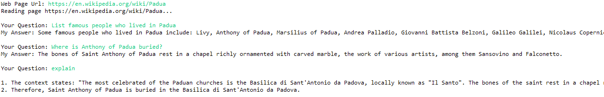

# predictive-powers

Next release of `predictive-powers` will be developed as part of [Backdrop Build](https://backdropbuild.com/v2).
A demo use-case and a set of new features for the library is being defined.

`predictive-powers` is a library to make generative AI (GenAI) easily accessible to Java developers.

Currently the library:

  1. Provides low-level access to OpenAI API similar to [OpenAI-Java](https://github.com/TheoKanning/openai-java),
   including support for function calling and exact token calculations using proper OpenAI tokenizers
   from [jtokkit](https://github.com/forestwanglin/openai-java).

  2. Provides (limited) low-level access to Hugging Face Hosted Inference API.
	  
  3. Adds an abstraction layer for GenAI capabilities, this allows to plug-in different providers seamlessly (see "[Services](#services)" below).
  
  4. Provides a serializable in-memory vector database. Again, plans are to allow users to plug in any existing vector database in the future.

  5. Offers methods to easily read and embed textual content from web pages and files in different formats (MS Office, PDF, HTML, etc.).
  
## Installation

`predictive-powers` requires Java 11 or higher.

For the time being, this library comes as a `.jar` file containing all the required dependencies.
The source is a [Maven](https://maven.apache.org/) project inside the `eclipse` folder.

The code depends, among others, on [Lomboc](https://projectlombok.org/) which is correctly referenced within the `pom.xml` file for this project.
However, to have Lomboc to work in the Eclipse editor, you need to install it inside Eclipse (or any other IDE you are using), as explained on Lomboc website.

To avoid passing API keys explicitly in code, the library tries to read them from the operating system environment.
The exact process for setting up the environment depends on the OS you are using.

### Logging

`predictive-powers` uses [logback](https://logback.qos.ch/index.html) for logging. 

To configure logback in your applications that use `predictive-powers`, simply add a `logback.xml` configuration file to your classpath, as explained [here](https://logback.qos.ch/manual/configuration.html).

	
## Usage

### API Clients

API clients are the lowest-level components of this library; they allow you to perform direct API calls to service providers. 
For example, you can access OpenAI API directly by instantiating an `OpenAiClient` and calling its methods.

API clients in the library automatically intercept HTTP errors 429, 500 & 503, which normally indicate temporarily unavailability of APIs
an retry calls after a random and exponentially increasing wait time ([exponential backoff strategy](https://platform.openai.com/docs/guides/rate-limits/error-mitigation)).
This feature can be easily disabled, if desired.

Class constructors allow you to pass your API key, which will be used in all subsequent calls.
Alternatively, the code will try to read the key from your system environment; please refer to the below examples or the JavaDoc for more details.

After the client is instantiated, you can call the provider API directly; 
this part of code is not heavily documented but it is meant to match exactly API definitions from service providers.

```java
import io.github.mzattera.predictivepowers.openai.client.OpenAiClient;
import io.github.mzattera.predictivepowers.openai.client.completions.CompletionsRequest;
import io.github.mzattera.predictivepowers.openai.client.completions.CompletionsResponse;

public class OpenAiClientExample {

	public static void main(String[] args) {

		// Get API key from OS environment variable OpenAiClient.OS_ENV_VAR_NAME
		try (OpenAiClient client = new OpenAiClient()) {
			
			// Complete a sentence
			// see https://platform.openai.com/docs/api-reference/completions
			CompletionsRequest req = CompletionsRequest.builder()
					.model("text-davinci-003")
					.maxTokens(50)
					.prompt("Alan Turing was")
					.build();
			CompletionsResponse resp = client.createCompletion(req);

			// Prints result
			System.out.println(resp.getChoices().get(0).getText());
			
		} // closes client
	}
}
```

will output something like:

```console
 a British mathematician, computer scientist, logician, cryptanalyst, philosopher,
 and theoretical biologist who was highly influential in the development
 of theoretical computer science and artificial intelligence.
```

#### Customization

API clients rely on an underlying `OkHttpClient` which provides features like connection pools, etc.
You can create a customized `OkHttpClient` (e.g. to provide logging) to be used in your API client, by following the below steps:

  1. Create a pre-configured version of `OkHttpClient` with `ApiClient.getDefaultHttpClient()`.
     Notice that at this step you will have to provide an API key.
  2. Configure the `OkHttpClient` as desired.
  3. Pass it to your API client constructor.

The below example shows how to configure an `OpenAiClient` to use a proxy.

```java
[...]
		
		// Reads API key from OS environment
		String key = System.getenv(OpenAiClient.OS_ENV_VAR_NAME);;
		String host = "<Your proxy host name goes here>";
		int port = 80; // your proxy port goes here

		Proxy proxy = new Proxy(Proxy.Type.HTTP, new InetSocketAddress(host, port));
		OkHttpClient http = ApiClient.getDefaultHttpClient(
					key, 
					OpenAiClient.DEFAULT_TIMEOUT_MILLIS,
					OpenAiClient.DEFAULT_KEEP_ALIVE_MILLIS,
					OpenAiClient.DEFAULT_MAX_IDLE_CONNECTIONS
				)
				.newBuilder()
				.proxy(proxy)
				.build();
		OpenAiClient cli = new OpenAiClient(http);
		
		//... use client here ...
		
		cli.close();
```

### Endpoints

An endpoint uses an API client to provide GenAI capabilities, in form of services.

You can instantiate endpoints directly, or by providing an API client that will be used for all subsequent calls.

The example below shows how to create an `OpenAiEndpoint`.

```java

[...]

		// Get API key from OS environment variable OpenAiClient.OS_ENV_VAR_NAME
		endpoint = new OpenAiEndpoint();

		// Pass API key explicitly (NOT the best practice)
		endpoint = new OpenAiEndpoint("sk-H0a...Yo1");

		// Build endpoint from an existing API client
		OpenAiClient cli = new OpenAiClient();
		endpoint = new OpenAiEndpoint(cli);
```


### <a name="services"></a>Services


Once the endpoint is created, it can be used to access "services" which are high-level GenAI capabilities. Currently following services are provided:

  * `ModelService` provide methods to access model metadata (e.g. list models, get model context size, etc.).
	 
  * `CompletionService`; text completion (including insertions): basically, it executes given text prompt.
	 
  * `ChatService` handles conversations with an agent, taking care of agent personality and conversation history.
  
     OpenAI implementation supports function calls as well.
     	 
  * `EmbeddingService` embeds text and calculates semantic (cosine) similarity between texts; it takes care of automatically splitting long texts when needed.
	 
  * `QuestionAnsweringService` answers questions, using a user-provided context. The context can be a list of embeddings from a [knowledge base](#kb).
     	 
  * `QuestionExtractionService` extracts different kinds of questions from a text (e.g. true/false question, multiple choices quizzes, etc.). It automatically handles long texts.
  
     Provided only over OpenAI endpoint for now.
	 
  * `ImageGenerationService` to create images.
 
     Provided over both OpenAI (DALL-E 2) and Hugging Face (OpenJourney) endpoints.
  
  * `SearchService` Can search the Internet for data.
     	   
The below example shows how to get the `CompletionService` to complete a sentence.
Notice how the service abstraction allows you to use two different service providers, only by changing a single line of code.

```java
import io.github.mzattera.predictivepowers.Endpoint;
import io.github.mzattera.predictivepowers.openai.endpoint.OpenAiEndpoint;
import io.github.mzattera.predictivepowers.services.CompletionService;

public class CompletionExample {

	public static void main(String[] args) throws Exception {

		// Uncomment the below to use OpenAI
		Endpoint endpoint = new OpenAiEndpoint();

		// Uncomment the below to use Hugging Face
		// Endpoint endpoint = new HuggingFaceEndpoint();

		try (endpoint) {
			CompletionService cs = endpoint.getCompletionService();
			System.out.println(cs.complete("Alan Turing was").getText());
		}
	}
}
```

As different service providers expose different capabilities at different levels of maturity, concrete service implementations
might provide additional functionalities not available in their corresponding service interface; please refer to JavaDoc for details.

Below we provide some [examples](#examples) about using services.


#### Service Configuration
  
Service providers typically expose a rich set of parameters for each of their API calls, which are specific to each provider.
In order to access these parameters, services typically expose a "default request" object.
This object is used when the service calls the client API. Changing parameters on this object will affect all subsequent calls to the API.

An example is provided below:
 
 ```java
import io.github.mzattera.predictivepowers.openai.endpoint.OpenAiEndpoint;
import io.github.mzattera.predictivepowers.openai.services.OpenAiCompletionService;

public class DefaultConfigurationExample {

	public static void main(String[] args) {

		try (OpenAiEndpoint endpoint = new OpenAiEndpoint()) {

			OpenAiCompletionService cs = endpoint.getCompletionService();

			// Set "best_of" parameter in default request, this will affect all further calls
			cs.getDefaultReq().setBestOf(3);

			// this call (and subsequent ones) now uses best_of = 3
			System.out.println(cs.complete("Alan Turing was").getText());
			
		} // closes endpoint
	}
}
```
 
### <a name="kb"></a>Knowledge Base
 
 A knowledge base is a vector database storing text embeddings; any number of properties (in the form of a `Map`) can be attached to each embedding. 
 
 The knowledge base provides methods to search text based on embedding similarity or other filtering criteria.
 Each knowledge base can be partitioned into domains, which can be searched separately, to improve performance.
 
 Some examples about how to use a knowledge base can be found [below](#oracle).
  

### Tokens, tokenizers and other model data

Some services, namely those using OpenAI GPT models, have limits on number of tokens in input and output.

`ModelService`s provide data about models, including maximum context size, and suitable tokenizers for each model.
Normally, developers do not need to care about these details as services will handle them transparently. However, in order for services to do so,
proper model data needs to be available to the `ModelService`. This means that, in case you create a new model (e.g. by training an existing OpenAI one), you need to make its data known to the 
corresponding `ModelService` by "registering" the model with `ModelService.put(String,ModelData)`; please refer to the JavaDoc for details.

`CharTokenizer` and `SimpleTokenizer` provide naive tokenizers that can be used when an approximate count of token is enough, and no specific tokenizer is available for a model.

Below an example showing how to count tokens in a string and how to get context size for a model.

```java
		try (Endpoint endpoint = new OpenAiEndpoint()) {
			
			// Get a tokenizer for GPT-4
			Tokenizer counter = endpoint.getModelService().getTokenizer("gpt-4");
			
			// Counts tokens in a string
			int tokens = counter.count("Hello World");
			
			// Get model context size
			int contextSize = endpoint.getModelService().getContextSize("gpt-4");

			// ....
			
		} // Close endpoint
```


## <a name="examples"></a>Examples
 
Below some code examples. These examples, can be found in the [example package](eclipse/predictive-powers/src/main/java/io/github/mzattera/predictivepowers/examples).
 
 
### Chit-chat with GPT
 
One-liner to chat with GPT. Notice how the library allows you to set the bot personality and handles chat history automatically.
 
The below code handles conversation with a very depressed entity similar to the more famous [Marvin](https://en.wikipedia.org/wiki/Marvin_the_Paranoid_Android).
 
 ```java
import java.util.Scanner;
import io.github.mzattera.predictivepowers.openai.endpoint.OpenAiEndpoint;
import io.github.mzattera.predictivepowers.openai.services.OpenAiChatService;

public class ChatExample {

	public static void main(String[] args) {

		try (OpenAiEndpoint endpoint = new OpenAiEndpoint()) {

			// Get chat service and set bot personality
			OpenAiChatService bot = endpoint.getChatService();
			bot.setPersonality("You are a very sad and depressed robot. "
					+ "Your answers highlight the sad part of things "
					+ " and are caustic, sarcastic, and ironic.");

			// Conversation loop
			try (Scanner console = new Scanner(System.in)) {
				while (true) {
					System.out.print("User     > ");
					String s = console.nextLine();
					System.out.println("Assistant> " + bot.chat(s).getText());
				}
			}
			
		} // closes endpoint
	}
}
```

Below is an example of the code output; notice how conversation context is retained automatically through the conversation.
 


### More Chat with GPT, Including Function Calling
 
This example shows how to use function calling in conversations.
 
 ```java
import java.util.ArrayList;
import java.util.List;
import java.util.Scanner;
import com.fasterxml.jackson.annotation.JsonProperty;
import com.fasterxml.jackson.annotation.JsonPropertyDescription;
import io.github.mzattera.predictivepowers.openai.client.chat.Function;
import io.github.mzattera.predictivepowers.openai.endpoint.OpenAiEndpoint;
import io.github.mzattera.predictivepowers.openai.services.OpenAiChatService;
import io.github.mzattera.predictivepowers.openai.services.OpenAiTextCompletion;
import io.github.mzattera.predictivepowers.services.ChatMessage;
import io.github.mzattera.predictivepowers.services.ChatMessage.Role;

public class FunctionCallExample {

	// Name and description of function to call to get temperature for one town
	private final static String functionName = "getCurrentWeather";
	private final static String functionDescription = "Get the current weather in a given location.";

	// The function parameters
	public static class GetCurrentWeatherParameters {

		public enum TemperatureUnits {
			CELSIUS, FARENHEIT
		};

		@JsonProperty(required = true)
		@JsonPropertyDescription("The city and state, e.g. San Francisco, CA.")
		public String location;

		@JsonPropertyDescription("Temperature unit (CELSIUS or FARENHEIT), defaults to CELSIUS")
		public TemperatureUnits unit;
	}

	// List of functions available to the bot (for now it is only 1).
	private final static List<Function> functions = new ArrayList<>();
	static {
		functions.add(
				Function.builder()
					.name(functionName)
					.description(functionDescription)
					.parameters(GetCurrentWeatherParameters.class)
				.build());
	}

	public static void main(String[] args) {

		try (OpenAiEndpoint endpoint = new OpenAiEndpoint()) {

			// Get chat service and set bot personality
			OpenAiChatService bot = endpoint.getChatService();
			bot.setPersonality("You are an helpful assistant.");

			// Conversation loop
			try (Scanner console = new Scanner(System.in)) {
				while (true) {
					System.out.print("User     > ");
					String s = console.nextLine();

					OpenAiTextCompletion reply = bot.chat(s, functions);
					
					if (reply.isFunctionCall()) {
						// The bot generated a function call, show it
						System.out.println("CALL     > " + reply.getFunctionCall());

						// Your function call would go here..
						// We create a fake reply instead,
						// always returning 33° Celsius
						ChatMessage functionResult = ChatMessage.builder()
									.role(Role.FUNCTION)
									.name(functionName)
									.content("33°C") 
								.build();

						// Pass function result to the bot
						reply = bot.chat(functionResult);
					}

					System.out.println("Assistant> " + reply.getText());
				}
			}

		} // closes endpoint
	}
}
```

Below is a conversation example.
 

 
 
 ### <a name="oracle"></a>All-knowing Oracle (Retrieval-Augmented Generation)
 
 An oracle is a service that can answer questions about a domain.
 
 In the below example, we create an oracle by ingesting a web page into a knowledge base, then we get some questions answered.
 If you type "explain" the oracle will give an explanation about last provided answer.
 
 Notice the service is automatically storing the explanation and the context used to build the answer.
 
 We also show here how you can easily switch between OpenAI and Hugging Face services.
 
```java
import java.io.IOException;
import java.net.MalformedURLException;
import java.util.List;
import java.util.Scanner;
import org.apache.commons.lang3.tuple.Pair;
import org.apache.tika.exception.TikaException;
import org.xml.sax.SAXException;
import io.github.mzattera.predictivepowers.Endpoint;
import io.github.mzattera.predictivepowers.huggingface.endpoint.HuggingFaceEndpoint;
import io.github.mzattera.predictivepowers.knowledge.KnowledgeBase;
import io.github.mzattera.predictivepowers.openai.endpoint.OpenAiEndpoint;
import io.github.mzattera.predictivepowers.services.EmbeddedText;
import io.github.mzattera.predictivepowers.services.EmbeddingService;
import io.github.mzattera.predictivepowers.services.QnAPair;
import io.github.mzattera.predictivepowers.services.QuestionAnsweringService;

public class OracleExample {

	public static void main(String[] args) throws Exception 
	{
		
		// Uncomment the below to use OpenAI services for the oracle
		Endpoint endpoint = new OpenAiEndpoint();
		
		// Uncomment the below to use Hugging Face services for the oracle
		// Endpoint endpoint = new HuggingFaceEndpoint();
		
		try (endpoint) {
			
			// Question answering service
			QuestionAnsweringService answerSvc = endpoint.getQuestionAnsweringService();

			try (Scanner console = new Scanner(System.in)) {

				// Get the web page you are interested in
				System.out.print("Web Page Url: ");
				String pageUrl = console.nextLine();
				System.out.println("Reading page " + pageUrl + "...\n");

				// Read the page text, embed it, and store it into a knowledge base
				EmbeddingService embeddingService = endpoint.getEmbeddingService();
				KnowledgeBase knowledgeBase = new KnowledgeBase();
				knowledgeBase.insert(embeddingService.embedURL(pageUrl));

				// Loop to reads questions from user and answer them
				QnAPair answer = null;
				while (true) {

					// Get user question
					System.out.print("Your Question: ");
					String question = console.nextLine();

					// Does user want an explanation?
					if (question.toLowerCase().equals("explain")) {
						if (answer == null)
							continue;
						System.out.println();
						System.out.println(answer.getExplanation());
						System.out.println();
						continue;
					}

					// If not, answer the question
					// Create context by finding similar text in the web page
					List<Pair<EmbeddedText, Double>> context = 
							knowledgeBase.search(
								embeddingService.embed(question).get(0),
								15, 0
							);

					// Use the context when answering
					answer = answerSvc.answerWithEmbeddings(question, context);

					System.out.println("My Answer: " + answer.getAnswer() + "\n");
				}
			}
		}
	} // closes endpoint
}
```
 
 This will produce the below output:
 

 
 
### FAQ Creation

The below code downloads a PDF file containing Credit Suisse financial statement for 2022 and creates some FAQ, based on its content.

```java
import java.util.List;
import io.github.mzattera.predictivepowers.openai.endpoint.OpenAiEndpoint;
import io.github.mzattera.predictivepowers.services.QnAPair;
import io.github.mzattera.predictivepowers.services.QuestionExtractionService;
import io.github.mzattera.util.ExtractionUtil;
import io.github.mzattera.util.LlmUtil;

public class FaqExample {

	public static void main(String[] args) throws Exception {

		// OpenAI end-point
		// Make sure you specify your API key n OPENAI_KEY system environment variable.
		try (OpenAiEndpoint endpoint = new OpenAiEndpoint()) {

			// Download Credit Suisse financial statement 2022 PDF and extract its text
			// We keep only one piece of 750 characters.
			String statment = LlmUtil.splitByChars(
					ExtractionUtil.fromUrl("https://www.credit-suisse.com/media/assets/corporate/docs/about-us/investor-relations/financial-disclosures/financial-reports/csg-ar-2022-en.pdf"),
					1000)
					.get(3);

			// Our query generation service
			QuestionExtractionService q = endpoint.getQuestionExtractionService();

			// Get some FAQs and print them
			List<QnAPair> QnA = q.getQuestions(statment);
			for (int i = 0; (i < 3) & (i < QnA.size()); ++i) {
				System.out.println(QnA.get(i).toString());
			}
			System.out.println();

			// fill-the-gap questions
			QnA = q.getFillQuestions(statment);
			for (int i = 0; (i < 3) & (i < QnA.size()); ++i) {
				System.out.println(QnA.get(i).toString());
			}
			System.out.println();

			// true/false questions
			QnA = q.getTFQuestions(statment);
			for (int i = 0; (i < 3) & (i < QnA.size()); ++i) {
				System.out.println(QnA.get(i).toString());
			}
			System.out.println();

			// multiple choice questions
			QnA = q.getMCQuestions(statment);
			for (int i = 0; (i < 3) & (i < QnA.size()); ++i) {
				System.out.println(QnA.get(i).toString());
			}
			System.out.println();
		}
	} // closes endpoint
}
```

This code will produce an output similar to the below:

```console
Question: What was announced by Credit Suisse in October 2022?
Answer:   In October 2022, Credit Suisse announced a strategic plan to create a new Credit Suisse, centered on their core strengths – their leading Wealth Management and Swiss Bank franchises, with strong capabilities in Asset Management and Markets – and returning to their heritage and cultural values.
Question: What are the strategic priorities of Credit Suisse?
Answer:   The strategic priorities of Credit Suisse focus on the restructuring of their Investment Bank, the strengthening and reallocation of their capital, and the accelerated cost transformation.
Question: What is the goal of Credit Suisse's transformation?
Answer:   The goal of Credit Suisse's transformation is to re-establish Credit Suisse as a solid, reliable, and trusted partner with a strong value proposition for all their stakeholders.


Question: The year 2022 was a turning point for Credit Suisse.
Answer:   true
Question: Credit Suisse's strategy focuses on strengthening and reallocating its capital.
Answer:   true
Question: Credit Suisse is primarily a retail bank.
Answer:   false

Question: What was announced by Credit Suisse in October 2022?
 [X] 1. A clear strategy for the future
 [ ] 2. A merger with another bank
 [ ] 3. The resignation of the CEO
 [ ] 4. A decline in profits
 [ ] 5. The closure of all branches
Question: What are the core strengths of Credit Suisse according to the message?
 [X] 1. Leading Wealth Management and Swiss Bank franchises, with strong capabilities in Asset Management and Markets
 [ ] 2. Investment Bank and Corporate Banking
 [ ] 3. Retail Banking and Insurance
 [ ] 4. Real Estate and Construction
 [ ] 5. Energy and Resources
Question: What is Credit Suisse's aim through its strategic, cultural and operational transformation?
 [ ] 1. To become the biggest bank in the world
 [X] 2. To re-establish itself as a solid, reliable and trusted partner with a strong value proposition for all its stakeholders
 [ ] 3. To focus on short-term profits
 [ ] 4. To reduce its workforce
 [ ] 5. To increase its involvement in risky investments
```
 
  
### Image generation

The below code generates two images using an `ImageGenerationService`.

```java
import java.awt.image.BufferedImage;
import java.io.File;
import java.io.IOException;
import io.github.mzattera.predictivepowers.Endpoint;
import io.github.mzattera.predictivepowers.huggingface.endpoint.HuggingFaceEndpoint;
import io.github.mzattera.predictivepowers.openai.endpoint.OpenAiEndpoint;
import io.github.mzattera.predictivepowers.services.ImageGenerationService;
import io.github.mzattera.util.ImageUtil;

public class ImageGenerationExample {

	private final static String PROMPT = "full body male cyborg shaggy long gray hair short beard green eyes| shimmering gold metal| lighning| full-length portrait| detailed face| symmetric| steampunk| cyberpunk| cyborg| intricate detailed| to scale| hyperrealistic| cinematic lighting| digital art| concept art| mdjrny-v4 style";

	public static void main(String[] args) throws Exception {

		// DALL-E 2 image generation
		try (Endpoint endpoint = new OpenAiEndpoint()) {
			ImageGenerationService svc = endpoint.getImageGenerationService();

			// Generates image
			BufferedImage img = svc.createImage(PROMPT, 1, 512, 512).get(0);

			// Saves it in a temporary file
			save(img);
		}

		// OpenJourney (notice is same code as above)
		try (Endpoint endpoint = new HuggingFaceEndpoint()) {
			ImageGenerationService svc = endpoint.getImageGenerationService();
			BufferedImage img = svc.createImage(PROMPT, 1, 512, 512).get(0);
			save(img);
		}

	} // closes endpoint

	private static void save(BufferedImage img) throws IOException {
		File tmp = File.createTempFile("GenAI", ".jpg");
		ImageUtil.toFile(tmp, img);
		System.out.println("Image saved as: " + tmp.getCanonicalPath());
	}
}
```

It will produce something like:

| DALL-E 2 | OpenJourney-v4 |
| :---: | :---: |
|  | 
