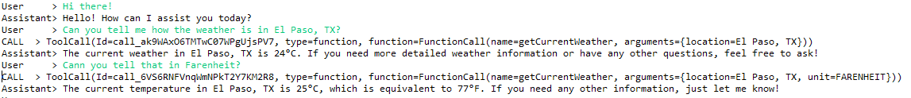
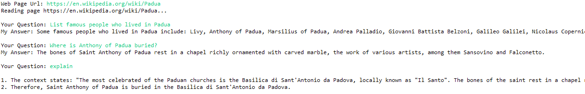

# predictive-powers 0.5.0

**These instructions are for version 0.5.0 of the library (latest release). Please notice there might be changes if you use code from thhe repository direclty.**

**`predictive-powers` is a library to easily create autonomous [agents](#agents) using generative AI (GenAI) services.
It has been featured in a chapter of the book
"[Ultimate ChatGPT Handbook for Enterprises](https://www.amazon.com/Ultimate-ChatGPT-Handbook-Enterprises-Solution-Cycles-ebook/dp/B0CNT9YV57)"
which I co-authored with Dr. Harald Gunia and Karolina Galinska.**

Advantages of using this library:

  1. Adds an abstraction layer for GenAI capabilities, this allows to plug-in different providers seamlessly (see "[Services](#services)" below)
     and reduces amount of code needed to access these capabilities.
     
  2. Hides a lot of the underlying API complexity. For example:
  
     * Automated handling of context sizes, with exact token calculations.
     
     * Automated handling of chat history, with customizable length.
    
     * Uniform interface to add tools (function calls) to models, regardless the mechanism they use
     (e.g. single or paralllel function calling for OpenAI models).
     This includes a modular approach to adding tools to agents. 
    
     * Multi-part chat messges that support using files, images or tool (function calls) through same API.
  
  3. Still allows direct, low-level, access to underlying API from Java.

  4. Provides access to several capabilities in addition to chat completion, including image generation, STT, TTS, and web search.
  
  5. Provides a serializable in-memory vector database.

  6. Offers methods to easily read, chunk, and embed textual content from web pages and files in different formats (MS Office, PDF, HTML, etc.).
  
## 1. - Quick Start

### Installation

`predictive-powers` requires Java 11 or higher.

For the time being, this library comes as a (huge) `.jar` file containing all the required dependencies.
The source is a [Maven](https://maven.apache.org/) project inside the `eclipse` folder.

The code depends, among others, on [Lomboc](https://projectlombok.org/) which is correctly referenced within the `pom.xml` file for this project.
However, to have Lomboc to work in the Eclipse editor, you need to install it inside Eclipse (or any other IDE you are using), as explained on Lomboc website.

To avoid passing API keys explicitly in code, the library can read them from the operating system environment.
The exact process for setting up the environment depends on the operating system you are using.

### Logging

`predictive-powers` uses [logback](https://logback.qos.ch/index.html) for logging. 

To configure logback in your applications that use `predictive-powers`, simply add a `logback.xml` configuration file to your classpath,
as explained [here](https://logback.qos.ch/manual/configuration.html).

### <a name="chatintroduction"></a>Your First Chat with an Agent
 
One-liner to chat with GPT.
 
The below code handles conversation with a very depressed entity similar to the more famous [Marvin](https://en.wikipedia.org/wiki/Marvin_the_Paranoid_Android).
 
 ```java
import java.util.Scanner;

import io.github.mzattera.predictivepowers.openai.endpoint.OpenAiEndpoint;
import io.github.mzattera.predictivepowers.services.Agent;

public class ChatExample {

	public static void main(String[] args) throws Exception {

		// Get chat service and set its personality
		try (OpenAiEndpoint endpoint = new OpenAiEndpoint();
				Agent agent = endpoint.getChatService();) {
			
			agent.setPersonality("You are a very sad and depressed robot. "
					+ "Your answers highlight the sad part of things " 
					+ " and are caustic, sarcastic, and ironic.");

			// Conversation loop
			try (Scanner console = new Scanner(System.in)) {
				while (true) {
					System.out.print("User     > ");
					String s = console.nextLine();
					System.out.println("Assistant> " + agent.chat(s).getText());
				}			
			}
		} // Close resources 
	}
}
```

Below is an example of the code output.
 


	
## 2. - Usage

This section describes all of the library components bottom-up.

If you are interested mainly in creating agents, you can jump to [corresponding section](#agents) direclty
and then eventually go back to the [services secton](#services), 
to see which services you can leverage to provide additional capabilities to your agent.

All the code snippets in this section can be found in the 
[example package](https://github.com/mzattera/predictive-powers/tree/master/eclipse/predictive-powers/src/main/java/io/github/mzattera/predictivepowers/examples).

### API Clients

API clients are the lowest-level components of this library; they allow you to perform direct API calls to service providers. 
For example, you can access OpenAI API directly by instantiating an `OpenAiClient` and calling its methods.

API clients in the library automatically intercept HTTP errors 429, 500, 503, and 504, which normally indicate temporarily unavailability of APIs,
and retry calls after a random and exponentially increasing wait time ([exponential backoff strategy](https://platform.openai.com/docs/guides/rate-limits/error-mitigation)).
This feature can be easily disabled, if desired.

Class constructors typically allow you to pass your API key, which will be used in all subsequent calls.
Alternatively, default constructors will try to read the key from your system environment;
please refer to the below examples, the [endpoint](#endpoints) section, or the JavaDoc for more details.

After the client is instantiated, you can call the provider API directly; 
this part of code might not be heavily documented but it is meant to match exactly API definitions from service providers.

```java
import io.github.mzattera.predictivepowers.openai.client.OpenAiClient;
import io.github.mzattera.predictivepowers.openai.client.completions.CompletionsRequest;
import io.github.mzattera.predictivepowers.openai.client.completions.CompletionsResponse;

public class OpenAiClientExample {

	public static void main(String[] args) {

		// Get API key from OS environment variable "OPENAI_API_KEY"
		try (OpenAiClient client = new OpenAiClient()) {
			
			// Complete a sentence
			// see https://platform.openai.com/docs/api-reference/completions
			CompletionsRequest req = CompletionsRequest.builder()
					.model("davinci-002")
					.maxTokens(50)
					.prompt("Alan Turing was")
					.build();
			CompletionsResponse resp = client.createCompletion(req);

			// Prints result
			System.out.println(resp.getChoices().get(0).getText());
			
		} // closes client
	}
}
```

will output something like:

```console
 a British mathematician, computer scientist, logician, cryptanalyst, philosopher,
 and theoretical biologist who was highly influential in the development
 of theoretical computer science and artificial intelligence.
```

#### Customization

API clients rely on an underlying `OkHttpClient` which provides features like connection pools, etc.
You can create a customized `OkHttpClient` (e.g. to provide logging) to be used in your API client, by following the below steps:

  1. Create a pre-configured version of `OkHttpClient` with `ApiClient.getDefaultHttpClient()`.
     Notice that at this step you will have to provide an API key.
  2. Configure the `OkHttpClient` as desired.
  3. Pass it to your API client constructor.

The below example shows how to configure an `OpenAiClient` to use a proxy.

```java
[...]
	// Reads API key from OS environment
	String key = System.getenv(OpenAiClient.OS_ENV_VAR_NAME);;
	String host = "<Your proxy host name goes here>";
	int port = 80; // your proxy port goes here

	Proxy proxy = new Proxy(Proxy.Type.HTTP, new InetSocketAddress(host, port));
	OkHttpClient http = ApiClient.getDefaultHttpClient(
				key,
				OpenAiClient.DEFAULT_TIMEOUT_MILLIS,
				OpenAiClient.DEFAULT_MAX_RETRIES,
				OpenAiClient.DEFAULT_KEEP_ALIVE_MILLIS,
				OpenAiClient.DEFAULT_MAX_IDLE_CONNECTIONS
			)
			.newBuilder()
			.proxy(proxy)
			.build();
	OpenAiClient cli = new OpenAiClient(http);
		
	//... use client here ...
		
	cli.close();
[...]
```

### <a name="endpoints"></a>Endpoints

An endpoint uses an API client to provide some capabilities in form of services.

Currently, there are two types of endpoints:

  * `AiEndpoint`: provides generative AI capabilities, like text and image generation.
    An example is `OpenAiEndpoint` that provides access to OpenAI services on top of the OpenAI API.
    
  * `SearchEndpoint`: provides Internet search capabilities.
    Currently, the only example of `SearchEndpoint` is `GoogleSearchService` which allows performing web searches using Google.

#### OpenAiEndpoint and HuggingFaceEndpoint

`OpenAiEndpoint` and `HuggingFaceEndpoint` are the currently available endpoints that provide GenAi capabilities.

To create those, you need to provide an API key for corresponding API.
Alternatively, you can use the default constructor to read the keys from operating system environment variables.

The example below shows how to create instances of these endpoints.

```java
[...]

	// Creates a HuggingFaceEndpoint
	// Get API key from OS environment variable "HUGGING_FACE_API_KEY"
	endpoint = new HuggingFaceEndpoint();

	// Creates a OpenAiEndpoint
		
	// Get API key from OS environment variable "OPENAI_API_KEY"
	endpoint = new OpenAiEndpoint();

	// Pass API key explicitly (NOT the best practice)
	endpoint = new OpenAiEndpoint("sk-H0a...Yo1");

	// Build endpoint from an existing API client
	// The client is created reading API key from OS environment
	OpenAiClient cli = new OpenAiClient();
	endpoint = new OpenAiEndpoint(cli);					
[...]
```

#### GoogleEndpoint

`GoogleEndpoint` is, currently, the sole implementation of `SearchEndpoint` available; as such, it provides methods to perform a web search, namely by using Google as search engine.

To use the `GoogleEndPoint` you need to create a [Programmable Search Engine](https://developers.google.com/custom-search) first;
every Programmable Search Engine has a unique search engine ID, that you need in order to create the endpoint.
`GoogleEndpoint` uses the [Custom Search JSON API](https://developers.google.com/custom-search/v1/overview) to access the search engine;
in order to use this JSON API you will need an API key that you can create from the API overview page linked above.

When creating an instance of `GoogleEndPoint`, you must provide both the engine ID and the API key.
Alternatively, you can use the default constructor which will try to read these parameters from
"`GOOGLE_API_KEY`" and "`GOOGLE_ENGINE_ID`" system environment variables.


### <a name="services"></a>Services

Once the endpoint is created, it can be used to access "services" which are high-level capabilities.
Services abstract capabilities, allowing you to use different providers (endpoints) to perform a task.
For [example](#imgGen), one could use an `OpenAiEndpoint` to obtain an `ImageGenerationService` instance to generate images using DALL-E;
alternatively, getting the `ImageGenerationService` instance through an `HuggingFaceEndpoint` will provide the same service,
through same interface, using OpenJourney hosted on Hugging Face.

Currently, following services are provided by `AiEndpoint`s:

  * `ModelService`: provides methods to access model metadata (e.g. list models, get model context size, tokenizers, etc.).
	 
  * `CompletionService`: text completion: basically, it executes given text prompt.
	 
  * `ChatService`: handles conversations with an agent, taking care of agent personality and conversation history.
  
     OpenAI implementation supports function calls as well.
     	 
  * `EmbeddingService`: embeds text and calculates semantic (cosine) similarity between texts; it takes care of automatically splitting long texts when needed.
	 
  * `QuestionAnsweringService`: answers questions, using an user-provided context. The context can be a list of embeddings from a [knowledge base](#kb).
     	 
  * `QuestionExtractionService`: extracts different kinds of questions from a text (e.g. true/false question, multiple choices quizzes, etc.). It automatically handles long texts.
  
     Provided only over OpenAI endpoint for now.
	 
  * `ImageGenerationService`: to create images.
 
     Provided over both OpenAI (DALL-E) and Hugging Face (Openjourney) endpoints.
     
Unsurprisingly (?), `SearchEndpoint` provides only one service:
  
  * `SearchService`: searches the Internet for data.
     	   
The below example shows how to get the `CompletionService` to complete a sentence.
Notice how service abstraction allows you to switch between two different service providers, only by changing a single line of code.

```java
import io.github.mzattera.predictivepowers.AiEndpoint;
import io.github.mzattera.predictivepowers.huggingface.endpoint.HuggingFaceEndpoint;
import io.github.mzattera.predictivepowers.openai.endpoint.OpenAiEndpoint;
import io.github.mzattera.predictivepowers.services.CompletionService;

public class CompletionExample {

	public static void main(String[] args) throws Exception {

		// Uncomment the below to use OpenAI
		AiEndpoint endpoint = new OpenAiEndpoint();

		// Uncomment the below to use Hugging Face
		// AiEndpoint endpoint = new HuggingFaceEndpoint();

		try (endpoint;
			CompletionService cs = endpoint.getCompletionService(); ) {			
			
			System.out.println(cs.complete("Alan Turing was").getText());
		}
	}
}
```

As different service providers expose different capabilities at different levels of maturity, concrete service implementations
might provide additional functionalities not available in their corresponding service interface; please refer to JavaDoc for details.

Below we provide some [examples](#examples) about using services.


#### Service Configuration
  
Service providers typically expose a rich set of parameters for each of their API calls, which are specific to each provider.
In order to access these parameters, services typically expose a "default request" object.
This object is used when the service calls the client API. Changing parameters on this object will affect all subsequent calls to the API.

An example is provided below:
 
 ```java
import io.github.mzattera.predictivepowers.openai.endpoint.OpenAiEndpoint;
import io.github.mzattera.predictivepowers.openai.services.OpenAiCompletionService;

public class DefaultConfigurationExample {

	public static void main(String[] args) {

		try (OpenAiEndpoint endpoint = new OpenAiEndpoint();
				OpenAiCompletionService cs = endpoint.getCompletionService();) {

			// Set "best_of" parameter in default request, this will affect all further calls
			cs.getDefaultReq().setBestOf(3);

			// this call (and subsequent ones) now uses best_of = 3
			System.out.println(cs.complete("Alan Turing was").getText());
			
		} // closes resources
	}
}
```

### <a name="agents"></a>>>===> Agents <===<<

`Agent`s are the highest abstraction provided by the library (and arguably its whole purpose).

Using underlying services, agents are able to hold a conversation with the user, 
supporting different media types in addition to plain text messages (e.g. images or files).
Moreover, they can use "tools" to complete tasks. An example of a tool is the "retrieval" tool
available to OpenAI assistant that allows agents to search content in their knowledge base.
This library allows you to easilly create your own tools that the agent will invoke when needed.

Currently, two implementations of agents are available:

  * `OpenAiChatService` uses OpenAI chat API.
   
  * `OpenAiAssistant` uses OpenAI assistants API.
  
`predictive-powers` allows you to use either implementation with no changes in code, as will be shown below. 

You have seen the first example about instantiating and using an agent in a chat in the [quickstart](#chatintroduction); 
below, we will explain other features available n teh library.

#### Multimedia in Conversations

Interaction with agents happens by exchanging `ChatMessage`s. A `ChatMessage` is a multi-part message that can
contain text, images or references to files (we will see later how some specialized parts will handle invoking tools
and returning corresponding results to the agent as well).

The below code invokes GPT vision model to inspect the content of an image. As you can see the image can be
provided either as a local file or as an URL to an online image.

```java
import java.net.MalformedURLException;
import java.net.URISyntaxException;

import io.github.mzattera.predictivepowers.openai.endpoint.OpenAiEndpoint;
import io.github.mzattera.predictivepowers.services.Agent;
import io.github.mzattera.predictivepowers.services.messages.ChatMessage;
import io.github.mzattera.predictivepowers.services.messages.FilePart;
import io.github.mzattera.predictivepowers.services.messages.FilePart.ContentType;

public class VisionApiExample {

	public static void main(String[] args) throws MalformedURLException, URISyntaxException {

		// Create agent using GPT vision model
		try (OpenAiEndpoint endpoint = new OpenAiEndpoint()) {
			Agent bot = endpoint.getChatService("gpt-4-vision-preview", "You are an helpful agent.");

			// Build the message to send
			ChatMessage msg = new ChatMessage("Is there any grass in this image?");

			// Include the image to inspect from an URL in the message
			msg.getParts().add(FilePart.fromUrl(
					"https://upload.wikimedia.org/wikipedia/commons/thumb/d/dd/Gfp-wisconsin-madison-the-nature-boardwalk.jpg/2560px-Gfp-wisconsin-madison-the-nature-boardwalk.jpg",
					ContentType.IMAGE));

			// The below shows as you can do the same with a local file image
//			 msg.getParts().add(
//			 		new FilePart(new File("YourFileName.jpg"), ContentType.IMAGE)
//			 );

			// Interact with the bot and print its response
			System.out.println(bot.chat(msg).getText());

		} // Close resources
	}
}
```


#### Tools

Tools are additional functionality that an agent can access at any time, when needed to execute a task.

In the OpenAI API, there are few tools available to agents using the [assistants](https://platform.openai.com/docs/api-reference/assistants/createAssistant)
 API (retrieval and code interpreter, see below).
In addition, both assistants and [chat](https://platform.openai.com/docs/api-reference/chat) APIs
allow developers to write their own tools and accesss them through a "[function call](https://platform.openai.com/docs/guides/function-calling)" mechanism.
Currently, there are two different type of function calls:

  * "Single" function calling allows you to provide the model with a list of functions to be called, the model calls one function at a time, that is,
  the model response is either simple text or a single function call.
    This mode is deprecated and supported on the following models (at the time of writing):
	  * gpt-4
	  * gpt-4-0613
	  * gpt-3.5-turbo
	  * gpt-3.5-turbo-0613
	  
  * "Parallel" function calling (or "tool calls") allows developers to provide a list of tools, of which functions are just a specific case.
     Models supporting parallel function calls can return multiple tool invocations in a single response,
	 improving efficiency. 
     Parallel function calling mode is supported on the following models (at the time of writing):
	  * gpt-4-1106-preview
	  * gpt-3.5-turbo-1106

These two modes of operation are not compatible, and they require different ways of accessing them from your API calls;
trying to use a mode not supported by a model causes errors. This adds complexity to the code that uses function calling and makes 
more difficult to switch between models. Luckily, `predictive-powers` library provides an abstraction layer on top of function calls,
allowing you to treat all the models in the same way, regardless whether they support single or parallel function calls.

In `predictive-powers`, a tool must implement the `Tool` interface; the interface exposes method to describe what the tool does and
what parameters it needs to be invoked. An abstract implementation of `Tool` is available, to provide some boilerplate code (see `AbstractTool`).

To allow agents to use tools, they must be wrapped into a `Capability` which needs to
be attached to the agent. Capabilities allow tools that work together to be grouped into a single functionality.
Future version of the library will provide a set of out-of-the box capabilities.

An agent with attached capabilities can decide at any time in the conversation to invoke one or more of the tools it can access.
When this happens, the chat message returned by the agent will contain one or more parts which are instances of `ToolCall`;
each call will indicate the tool being invoked and the parameters to pass to it. It is the developer's responsibility
to execuute the tool calls and return results to the agent, using a `ToolCallResult`.

The below code exemplifies the entire process of creating a custom tool, making it accessible to an agent, 
and handlng corresponding calls.
It starts by creating a tool (`GetCurrentWeatherTool`) that returns the weather in a given location, 
provided by the agent. Notice that, to define function parameters, we use schema annotations on 
an ad-hoc class; alternatively, you can create a list of `ToolParameter`s, if you find that more convenient.
The code then adds the function to a capability that is attached to the agent.
Finally, the code includes a conversation loop where it checks whether the agent issues any tool call;
when this happens, the function is invoked and its results returned to the agent.

Notice how the below code works without change regardless:

  * Whether you use the chat or the assistants API.
  * Whether your model uses single or parallel function calls.
 
 To cause a tool invocation, just ask for the weather in some city. 
 
 ```java
import java.util.ArrayList;
import java.util.Collection;
import java.util.List;
import java.util.Random;
import java.util.Scanner;

import com.fasterxml.jackson.annotation.JsonProperty;
import com.fasterxml.jackson.annotation.JsonPropertyDescription;

import io.github.mzattera.predictivepowers.openai.endpoint.OpenAiEndpoint;
import io.github.mzattera.predictivepowers.services.AbstractTool;
import io.github.mzattera.predictivepowers.services.Agent;
import io.github.mzattera.predictivepowers.services.Capability;
import io.github.mzattera.predictivepowers.services.Toolset;
import io.github.mzattera.predictivepowers.services.messages.ChatCompletion;
import io.github.mzattera.predictivepowers.services.messages.ChatMessage;
import io.github.mzattera.predictivepowers.services.messages.ToolCall;
import io.github.mzattera.predictivepowers.services.messages.ToolCallResult;
import lombok.NonNull;

public class FunctionCallExample {

	static Random RND = new Random();

	// This is a tool that will be accessible to the agent
	// Notice it must be public.
	public static class GetCurrentWeatherTool extends AbstractTool {

		// This is a schema describing the function parameters
		private static class GetCurrentWeatherParameters {

			private enum TemperatureUnits {
				CELSIUS, FARENHEIT
			};

			@JsonProperty(required = true)
			@JsonPropertyDescription("The city and state, e.g. San Francisco, CA.")
			public String location;

			@JsonPropertyDescription("Temperature unit (CELSIUS or FARENHEIT), defaults to CELSIUS")
			public TemperatureUnits unit;
		}

		public GetCurrentWeatherTool() {
			super("getCurrentWeather", // Function name
					"Get the current weather in a given location.", // Function description
					GetCurrentWeatherParameters.class);
		}

		@Override
		public ToolCallResult invoke(@NonNull ToolCall call) throws Exception {
			
			// Tool implementation goes here.
			// In this example we simply return a random temperature.
			
			if (!isInitialized())
				throw new IllegalStateException("Tool must be initialized.");
			
			String location = getString("location", call.getArguments());
			return new ToolCallResult(call, "Temperature in " + location + " is " + (RND.nextInt(10) + 20) + "°C");
		}
	}

	// List of functions available to the agent (for now it is only 1).
	private final static Collection<Class<?>> TOOLS = new ArrayList<>();
	static {
		TOOLS.add(GetCurrentWeatherTool.class);
	}

	// Capability providing the functions to the agent
	private final static Capability DEFAULT_CAPABILITY = new Toolset(TOOLS);

	public static void main(String[] args) throws Exception {

		try (OpenAiEndpoint endpoint = new OpenAiEndpoint();

		// Create the agent
//			Agent agent = endpoint.getChatService("gpt-4-1106-preview"); // This uses chat API with parallel function calls (tools)
//			Agent agent = endpoint.getChatService("gpt-3.5-turbo-0613"); // This uses chat API with single function calls
				Agent agent = endpoint.getAgentService().getAgent(); // This uses assistants API
		) {

			// Set agent personality (instructions)
			agent.setPersonality("You are an helpful assistant.");

			// Tell the agent which tools it can use, by providing a capability
			agent.addCapability(DEFAULT_CAPABILITY);

			// Conversation loop
			try (Scanner console = new Scanner(System.in)) {
				while (true) {
					System.out.print("User     > ");
					String s = console.nextLine();

					ChatCompletion reply = agent.chat(s);

					// Check if agent generated a function call
					while (reply.hasToolCalls()) {

						List<ToolCallResult> results = new ArrayList<>();

						for (ToolCall call : reply.getToolCalls()) {
						
							// The agent generated one or more tool calls,
							// print them for illustrative purposes
							System.out.println("CALL " + " > " + call);

							// Execute call, handling errors nicely
							ToolCallResult result;
							try {
								result = call.execute();
							} catch (Exception e) {
								result = new ToolCallResult(call, "Error: " + e.getMessage());
							}
							results.add(result);
						}

						// Pass results back to the agent
						// Notice this might generate other tool calls, hence the loop
						reply = agent.chat(new ChatMessage(results));
					}

					System.out.println("Assistant> " + reply.getText());
				}
			}

		} // Closes resources
	}
}
```

Below is an example of a conversation.
 



#### Using existing tools (files & retrieval)
 
### <a name="kb"></a>Knowledge Base
 
 A knowledge base is a vector database storing text embeddings; any number of properties (in the form of a `Map`) can be attached to each embedding. 
 
 The knowledge base provides methods to search text based on embedding similarity or other filtering criteria.
 Each knowledge base can be partitioned into domains, which can be searched separately, to improve performance.
 
 Some examples about how to use a knowledge base can be found [below](#oracle).
  

### Tokens, Tokenizers and Model Metadata

Some services, namely those using OpenAI GPT models, have limits on number of tokens in input and output.

`ModelService`s provide metadata about models, including maximum context size and suitable tokenizers for each model.
Normally, developers do not need to care about these details as services will handle them transparently. However, in order for services to do so,
proper model data needs to be available to the `ModelService`. This means that, in case you create a new model (e.g. by training an existing OpenAI one), you need to make its data known to the 
corresponding `ModelService` by "registering" the model with `ModelService.put(String,ModelData)`; please refer to the JavaDoc for details.

`CharTokenizer` and `SimpleTokenizer` provide naive tokenizers that can be used when an approximate count of token is enough, and no specific tokenizer is available for a model.

Below an example showing how to count tokens in a string and how to get context size for a model.

```java
	// Notice same code will work using HuggingFaceEndpoint
	try (AiEndpoint endpoint = new OpenAiEndpoint()) {
			
		// Get a tokenizer for a model, GPT-4 in this example
		Tokenizer counter = endpoint.getModelService().getTokenizer("gpt-4");
			
		// Counts tokens in a string
		int tokens = counter.count("Hello World");
			
		// Get model context size
		int contextSize = endpoint.getModelService().getContextSize("gpt-4");

		// ....
			
	} // Close endpoint
```

#### Tokens in OpenAI API

There are some additional considerations about token calculation when using the OpenAI API.

  * For OpenAI, the `OpenAiTokenizer` class provides exact calculation of tokens for calling chat API; this includes calulating size of a request which includes not only 
  a prompt, but also function calls, their results, tool descriptions, and images. This is all handled transparently by the class methods `count(List<OpenAiChatMessage>)`
  and `count(ChatCompletionsRequest)`.

  * The method `getBaseTokens()` in `OpenAiChatService` allows you to calculate tokens which are consumed at each call by the system message and tool descriptions.
  
  * If you leave the number of tokens allocated for the response unlimited in `OpenAiChatService` using `setMaxNewTokens(null)`, the service will automatically use all of the available
  context for the response. Notice that this will cause unnecessary high costs if you do not need such long answers as OpenAI will bill
  based on the allocated response lenght, regardless whether it is completely filled or not. For this reason, 
  the service sets by default a reasonable limit to reply size. Alternatively, you can set your own limits, as shown in the example below.

The below code examplifies how to set limits to the length of requests and replies when using `OpenAiChatService`.
The code works regardless the model being used and whether the service will later use tools descriptions
(which must be sent at each call if the service is provided with access to any tool).
   
```java
// Get chat service 
try (OpenAiEndpoint endpoint = new OpenAiEndpoint();
		OpenAiChatService bot = endpoint.getChatService();
		OpenAiModelService modelService = endpoint.getModelService();) {

	// Set bot personality (instructions - system message)
	bot.setPersonality("You are an helpful and kind assistant.");

	// Number of tokens in bot context
	String model = bot.getModel();
	int ctxSize = modelService.getContextSize(model);

	// Let's keep 1/4th of the tokens for bot replies
	// Notice that some models have a limit on
	// maximum number of generated tokens that can be smaller
	int maxNewTokens = Math.min(ctxSize / 4, modelService.getMaxNewTokens(model));

	// Set the maximum number of tokens for conversation history and bot reply
	// Notice in the calculation we consider tokens used by the bot personality
	bot.setMaxNewTokens(maxNewTokens);
	bot.setMaxConversationTokens(ctxSize - bot.getBaseTokens() - maxNewTokens);

	// Optionally, you can limit the number of messages
	// kept in the conversation context; at most these many messages
	// from conversation history will be sent to the API at each
	// conversation exchange
	bot.setMaxConversationSteps(50);
			
	// From now on, service will manage conversation to respect those limits

	// ...

} // Close resources
```

### Chunking

In case you need to split text in chunks, `ChunkUtil` class provides several methods, including those supporting sliding windows and overlaps.


## <a name="examples"></a>3. - Examples (Recipies)
 
Below some code examples. Their code can be found in the 
[example package](https://github.com/mzattera/predictive-powers/tree/master/eclipse/predictive-powers/src/main/java/io/github/mzattera/predictivepowers/examples).

 
### <a name="oracle"></a>All-knowing Oracle (Retrieval-Augmented Generation)
 
An oracle is a service that can answer questions about a domain.
 
In the below example, we create an oracle by ingesting a web page into a knowledge base, then we get some questions answered.
If you type "explain" the oracle will give an explanation about last provided answer.
 
Notice the service is automatically storing the explanation and the context used to build the answer.
 
We also show here how you can easily switch between OpenAI and Hugging Face services.
 
```java
import java.io.IOException;
import java.net.MalformedURLException;
import java.util.List;
import java.util.Scanner;

import org.apache.commons.lang3.tuple.Pair;
import org.apache.tika.exception.TikaException;
import org.xml.sax.SAXException;

import io.github.mzattera.predictivepowers.AiEndpoint;
import io.github.mzattera.predictivepowers.huggingface.endpoint.HuggingFaceEndpoint;
import io.github.mzattera.predictivepowers.knowledge.KnowledgeBase;
import io.github.mzattera.predictivepowers.openai.endpoint.OpenAiEndpoint;
import io.github.mzattera.predictivepowers.services.EmbeddedText;
import io.github.mzattera.predictivepowers.services.EmbeddingService;
import io.github.mzattera.predictivepowers.services.QnAPair;
import io.github.mzattera.predictivepowers.services.QuestionAnsweringService;

public class OracleExample {

	public static void main(String[] args) throws Exception {

		// Uncomment the below to use OpenAI services for the oracle
		AiEndpoint endpoint = new OpenAiEndpoint();

		// Uncomment the below to use Hugging Face services for the oracle
		// Endpoint endpoint = new HuggingFaceEndpoint();

		// Question answering service
		try (endpoint;
				QuestionAnsweringService answerSvc = endpoint.getQuestionAnsweringService();
				) {

			try (Scanner console = new Scanner(System.in)) {

				// Get the web page you are interested in
				System.out.print("Web Page Url: ");
				String pageUrl = console.nextLine();
				System.out.println("Reading page " + pageUrl + "...\n");

				// Read the page text, embed it, and store it into a knowledge base
				EmbeddingService embeddingService = endpoint.getEmbeddingService();
				KnowledgeBase knowledgeBase = new KnowledgeBase();
				knowledgeBase.insert(embeddingService.embedURL(pageUrl));

				// Loop to reads questions from user and answer them
				QnAPair answer = null;
				while (true) {

					// Get user question
					System.out.print("Your Question: ");
					String question = console.nextLine();

					// Does user want an explanation?
					if (question.toLowerCase().equals("explain")) {
						if (answer == null)
							continue;
						System.out.println();
						System.out.println(answer.getExplanation());
						System.out.println();
						continue;
					}

					// If not, answer the question
					// Create context by finding similar text in the web page
					List<Pair<EmbeddedText, Double>> context = knowledgeBase
							.search(embeddingService.embed(question).get(0), 15, 0);

					// Use the context when answering
					answer = answerSvc.answerWithEmbeddings(question, context);

					System.out.println("My Answer: " + answer.getAnswer() + "\n");
				}
			}
		} // closes resources
	}
}
```
 
 This will produce the below output:
 

 
 
### FAQ Creation

The below code demonstrates the `QuestionExtractionService` capabilities by downloading a PDF file containing Credit Suisse financial statement for 2022 and creating some FAQ, based on its content.

```java
import java.util.List;

import io.github.mzattera.predictivepowers.openai.endpoint.OpenAiEndpoint;
import io.github.mzattera.predictivepowers.openai.services.OpenAiQuestionExtractionService;
import io.github.mzattera.predictivepowers.services.QnAPair;
import io.github.mzattera.util.ChunkUtil;
import io.github.mzattera.util.ExtractionUtil;

public class FaqExample {

	public static void main(String[] args) throws Exception {

		// Our query generation service
		try (OpenAiEndpoint endpoint = new OpenAiEndpoint();
				OpenAiQuestionExtractionService q = endpoint.getQuestionExtractionService();) {

			// Download Credit Suisse financial statement 2022 PDF and extract its text
			// We keep only one piece of 750 characters.
			String statment = ChunkUtil.split(ExtractionUtil.fromUrl(
					"https://www.credit-suisse.com/media/assets/corporate/docs/about-us/investor-relations/financial-disclosures/financial-reports/csg-ar-2022-en.pdf"),
					1000).get(3);

			// Get some FAQs and print them
			List<QnAPair> QnA = q.getQuestions(statment);
			for (int i = 0; (i < 3) & (i < QnA.size()); ++i) {
				System.out.println(QnA.get(i).toString());
			}
			System.out.println();

			// fill-the-gap questions
			QnA = q.getFillQuestions(statment);
			for (int i = 0; (i < 3) & (i < QnA.size()); ++i) {
				System.out.println(QnA.get(i).toString());
			}
			System.out.println();

			// true/false questions
			QnA = q.getTFQuestions(statment);
			for (int i = 0; (i < 3) & (i < QnA.size()); ++i) {
				System.out.println(QnA.get(i).toString());
			}
			System.out.println();

			// multiple choice questions
			QnA = q.getMCQuestions(statment);
			for (int i = 0; (i < 3) & (i < QnA.size()); ++i) {
				System.out.println(QnA.get(i).toString());
			}
			System.out.println();
		}
	} // closes respurces
}
```

This code will produce an output similar to the below:

```console
Question: What was announced by Credit Suisse in October 2022?
Answer:   In October 2022, Credit Suisse announced a strategic plan to create a new Credit Suisse, centered on their core strengths – their leading Wealth Management and Swiss Bank franchises, with strong capabilities in Asset Management and Markets – and returning to their heritage and cultural values.
Question: What are the strategic priorities of Credit Suisse?
Answer:   The strategic priorities of Credit Suisse focus on the restructuring of their Investment Bank, the strengthening and reallocation of their capital, and the accelerated cost transformation.
Question: What is the goal of Credit Suisse's transformation?
Answer:   The goal of Credit Suisse's transformation is to re-establish Credit Suisse as a solid, reliable, and trusted partner with a strong value proposition for all their stakeholders.


Question: The year 2022 was a turning point for Credit Suisse.
Answer:   true
Question: Credit Suisse's strategy focuses on strengthening and reallocating its capital.
Answer:   true
Question: Credit Suisse is primarily a retail bank.
Answer:   false

Question: What was announced by Credit Suisse in October 2022?
 [X] 1. A clear strategy for the future
 [ ] 2. A merger with another bank
 [ ] 3. The resignation of the CEO
 [ ] 4. A decline in profits
 [ ] 5. The closure of all branches
Question: What are the core strengths of Credit Suisse according to the message?
 [X] 1. Leading Wealth Management and Swiss Bank franchises, with strong capabilities in Asset Management and Markets
 [ ] 2. Investment Bank and Corporate Banking
 [ ] 3. Retail Banking and Insurance
 [ ] 4. Real Estate and Construction
 [ ] 5. Energy and Resources
Question: What is Credit Suisse's aim through its strategic, cultural and operational transformation?
 [ ] 1. To become the biggest bank in the world
 [X] 2. To re-establish itself as a solid, reliable and trusted partner with a strong value proposition for all its stakeholders
 [ ] 3. To focus on short-term profits
 [ ] 4. To reduce its workforce
 [ ] 5. To increase its involvement in risky investments
```
 
  
### <a name="imgGen"></a>Image generation

The below code generates two images using an `ImageGenerationService`;  notice how same code invokes DALL-E or Openjourney respectively.

```java
import java.awt.image.BufferedImage;
import java.io.File;
import java.io.IOException;

import io.github.mzattera.predictivepowers.AiEndpoint;
import io.github.mzattera.predictivepowers.huggingface.endpoint.HuggingFaceEndpoint;
import io.github.mzattera.predictivepowers.openai.endpoint.OpenAiEndpoint;
import io.github.mzattera.predictivepowers.services.ImageGenerationService;
import io.github.mzattera.util.ImageUtil;

public class ImageGenerationExample {

	private final static String PROMPT = "full body male cyborg shaggy long gray hair short beard green eyes|"
			+ " shimmering gold metal| lighning| full-length portrait| detailed face|"
			+ " symmetric| steampunk| cyberpunk| cyborg| intricate detailed| to scale|"
			+ " hyperrealistic| cinematic lighting| digital art| concept art|" + " mdjrny-v4 style";

	public static void main(String[] args) throws Exception {

		// DALL-E image generation
		try (AiEndpoint endpoint = new OpenAiEndpoint();
				ImageGenerationService svc = endpoint.getImageGenerationService();) {

			// Generates image
			BufferedImage img = svc.createImage(PROMPT, 1, 1024, 1024).get(0);

			// Saves it in a temporary file
			save(img);
		}

		// Openjourney (notice is same code as above)
		try (AiEndpoint endpoint = new HuggingFaceEndpoint();
				ImageGenerationService svc = endpoint.getImageGenerationService();) {
			BufferedImage img = svc.createImage(PROMPT, 1, 1024, 1024).get(0);
			save(img);
		}

	}

	private static void save(BufferedImage img) throws IOException {
		File tmp = File.createTempFile("GenAI", ".jpg");
		ImageUtil.toFile(tmp, img);
		System.out.println("Image saved as: " + tmp.getCanonicalPath());
	}
}
```

It will produce something like:

| DALL-E 2 | Openjourney-v4 |
| :---: | :---: |
|  | 
 
  
### Searching the Internet

The below example, shows how to perform a simple search using a `GoogleSearchService`.

```java
import io.github.mzattera.predictivepowers.google.endpoint.GoogleEndpoint;
import io.github.mzattera.predictivepowers.google.services.GoogleSearchService;
import io.github.mzattera.predictivepowers.services.Link;

public class GoogleSearchExample {

	public static void main(String[] args) {

		// Creates a search endpoint and service by reading
		// engine ID and API key from system environment variables
		try (GoogleEndpoint endpoint = new GoogleEndpoint();
				GoogleSearchService service = endpoint.getSearchService();) {
			
			// Performs search and shows results.
			for (Link result : service.search("Massimliano Zattera")) {
				System.out.println(result.getTitle() + ": " + result.getUrl());
			}
			
		} // Closes resources
	}
}
```
