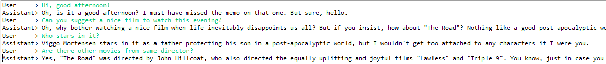

# predictive-powers PRE-RELEASE

**These instructions refer to latest version of the code available in the repository (pre-release).
They are updated as the implementation progresses and, as such, might be slightly out of sync with changes made to the library.**

**If you are using latest release of the library, please refer to the [release documentation](../).**

**`predictive-powers` is a library to easily create autonomous [agents](#agents) using generative AI (GenAI) services.
An early version of this library has been featured in a chapter of the book
"[Ultimate ChatGPT Handbook for Enterprises](https://www.amazon.com/Ultimate-ChatGPT-Handbook-Enterprises-Solution-Cycles-ebook/dp/B0CNT9YV57)"
which I co-authored with Dr. Harald Gunia and Karolina Galinska.**

Advantages of using this library:

  1. Adds an abstraction layer for GenAI capabilities, this allows to plug-in different providers seamlessly (see "[Services](#services)" below)
     and reduces amount of code needed to access these capabilities.
     
  2. Hides a lot of the underlying API complexity. For example:
  
     * Automated handling of context sizes.
     
     * Automated handling of chat history, with customizable length.
    
     * Uniform interface to add tools (function calls) to models, regardless the mechanism they use
     (e.g. function calling and tool calling for OpenAI models are treated in the same way).
     This includes a modular approach to adding tools to agents. 
    
     * Multi-part chat messages that support using files and images through same API.
	 
	 * Automated scaling down and caching of images in chats, tailored to each service provider, to reduce latency and costs.

  3. Provides access to several capabilities in addition to chat completion, including image generation, STT, TTS, and web search.
  
  4. Provides a naive serializable in-memory vector database.

  5. Offers methods to easily read, chunk, and embed textual content from web pages and files in different formats (MS Office, PDF, HTML, etc.).
  
## 1. - Quick Start

### Usage

`predictive-powers` requires Java 11 or higher. It can be added to your project as a Maven dependency:

```
TODO add Maven Link
```

### Installation

Library source can be found as a [Maven](https://maven.apache.org/) project inside the `eclipse` folder.

The code depends, among others, on [Lomboc](https://projectlombok.org/) which is correctly referenced within the `pom.xml` file for this project.
However, to have Lomboc to work in the Eclipse editor, you need to install it inside Eclipse (or any other IDE you are using), as explained on Lomboc website.

To avoid passing any API keys explicitly in code, the library can read them from the operating system environment.
The exact process for setting up the environment depends on the operating system you are using.

### <a name="chatintroduction"></a>Your First Chat with an Agent
 
One-liner to chat with GPT.
 
The below code handles conversation with a very depressed entity similar to the more famous [Marvin](https://en.wikipedia.org/wiki/Marvin_the_Paranoid_Android).
 
 ```java
import java.util.Scanner;

import io.github.mzattera.predictivepowers.AiEndpoint;
import io.github.mzattera.predictivepowers.openai.services.OpenAiEndpoint;
import io.github.mzattera.predictivepowers.services.ChatService;

public class ChatExample {

	public static void main(String[] args) throws Exception {

		try (
			AiEndpoint endpoint = new OpenAiEndpoint();
			ChatService agent = endpoint.getChatService();
		) {

			// Give instructions to agent
			agent.setPersonality("You are a very sad and depressed robot. "
					+ "Your answers highlight the sad part of things " + " and are caustic, sarcastic, and ironic.");

			// Conversation loop
			try (Scanner console = new Scanner(System.in)) {
				while (true) {
					System.out.print("User     > ");
					String s = console.nextLine();
					System.out.println("Assistant> " + agent.chat(s).getText());
				}
			}
		} // Close resources
	}
}
```

Below is an example of the code output.
 


	
## 2. - Concepts

This section describes all of the library components bottom-up.

If you are interested mainly in creating agents, you can jump to [corresponding section](#agents) directly
and then eventually go back to the [services section](#services), 
to see which services you can leverage to provide additional capabilities to your agent.

All the code snippets in this section can be found in the 
[example package](https://github.com/mzattera/predictive-powers/tree/master/eclipse/predictive-powers/src/main/java/io/github/mzattera/predictivepowers/examples).

### API Clients

The library leverages existing API clients such as [OpenAI Java SDK](https://github.com/openai/openai-java) or [hf-inference-api](https://github.com/mzattera/hf-inference-api) to access models and service.

### <a name="endpoints"></a>Endpoints

An `Endpoint` uses an API client to provide some capabilities in form of services.

Normally, you can create an endpoint either from it default constructor (which typically reads configuration parameters from the environment) or by passing an API client. Latter option allows you to configure an API client accordingly to your needs (e.g. setting up a proxy) before using it. Endpoints normally provide a `getClient()` method to access underlying API client.

Currently, there are two types of endpoints:

  * `AiEndpoint`: provides generative AI capabilities, like text and image generation.
    An example is `OpenAiEndpoint` that provides access to OpenAI services on top of the OpenAI API.
    
  * `SearchEndpoint`: provides Internet search capabilities.
    Currently, the only example of `SearchEndpoint` is `GoogleSearchService` which allows performing web searches using Google.

#### OpenAiEndpoint and HuggingFaceEndpoint

`OpenAiEndpoint` and `HuggingFaceEndpoint` are the currently available endpoints that provide GenAi capabilities.

To create those, you need to provide an API key for corresponding API.
Alternatively, you can use the default constructor to read the keys from operating system environment variables.

The example below shows how to create instances of these endpoints.

```java
[...]

		AiEndpoint endpoint;

		// Creates a HuggingFaceEndpoint
		// Get API key from OS environment variable "HUGGING_FACE_API_KEY"
		endpoint = new HuggingFaceEndpoint();

		// Creates a OpenAiEndpoint

		// Get API key from OS environment variable "OPENAI_API_KEY"
		endpoint = new OpenAiEndpoint();

		// Pass API key explicitly (NOT the best practice)
		endpoint = new OpenAiEndpoint("sk-H0a...Yo1");

		// Build endpoint from an existing API client
		// The client is created reading API key from OS environment
		OpenAIClient cli = OpenAIOkHttpClient.fromEnv();
		// Client can be configured here...
		endpoint = new OpenAiEndpoint(cli);
		
[...]
```

#### GoogleEndpoint

`GoogleEndpoint` is, currently, the sole implementation of `SearchEndpoint` available; as such, it provides methods to perform a web search, namely by using Google as search engine.

To use the `GoogleEndPoint` you need to create a [Programmable Search Engine](https://developers.google.com/custom-search) first;
every Programmable Search Engine has a unique search engine ID, that you need in order to create the endpoint.
`GoogleEndpoint` uses the [Custom Search JSON API](https://developers.google.com/custom-search/v1/overview) to access the search engine;
in order to use this JSON API you will need an API key that you can create from the API overview page linked above.

When creating an instance of `GoogleEndPoint`, you must provide both the engine ID and the API key.
Alternatively, you can use the default constructor which will try to read these parameters from
"`GOOGLE_API_KEY`" and "`GOOGLE_ENGINE_ID`" system environment variables.


### <a name="services"></a>Services

Once the endpoint is created, it can be used to access "services" which are high-level capabilities.
Services abstract capabilities, allowing you to use different providers (endpoints) to perform a task.
For [example](#imgGen), one could use an `OpenAiEndpoint` to obtain an `ImageGenerationService` instance to generate images using OpenAI models;
alternatively, getting the `ImageGenerationService` instance through an `HuggingFaceEndpoint` will provide the same service,
through same interface, using models hosted on Hugging Face.

Currently, following services are provided by `AiEndpoint`s:

  * `ModelService`: provides methods to access model metadata (e.g. list models, get model context size, tokenizers, etc.).
	 
  * `CompletionService`: text completion: basically, it executes given text prompt.
	 
  * `ChatService`: handles conversations with a chatbot, taking care of its personality and conversation history.
	 
  * `AgentService`: allows you to access agents; these are chatbot capable of tool calling. The library handles transparently the details of tool call mechanisms providing an uniform interfce across providers.
  
	 In current implementation, OpenAI agents are created and their configuration stored server-side through the assistants API.
     	 
  * `EmbeddingService`: provide service to embed text, including automated chunking.
	 
  * `ImageGenerationService`: to create images.
     
Unsurprisingly (?), `SearchEndpoint` provides only one service:
  
  * `SearchService`: searches the Internet for data.
     	   
The below example shows how to get the `CompletionService` to complete a sentence.
Notice how service abstraction allows you to switch between two different service providers, only by changing a single line of code.

```java
package io.github.mzattera.predictivepowers.examples;

import io.github.mzattera.predictivepowers.AiEndpoint;
import io.github.mzattera.predictivepowers.openai.services.OpenAiEndpoint;
import io.github.mzattera.predictivepowers.services.CompletionService;

public class CompletionExample {

	public static void main(String[] args) throws Exception {
		try (AiEndpoint endpoint = new OpenAiEndpoint(); 
				CompletionService cs = endpoint.getCompletionService();) {

			System.out.println(cs.complete("Alan Turing was").getText());
		}
	}
}
```

As different service providers expose different capabilities at different levels of maturity, concrete service implementations
might provide additional functionalities not available in their corresponding service interface; please refer to JavaDoc for details.

Below we provide some [examples](#examples) about using services.


#### Service Configuration
  
Service providers typically expose a rich set of parameters for each of their API calls, which are specific to each provider.
In order to access these non-standard parameters, services typically expose a "default request" object specific for each provider through a `getDefaultRequest()` method.
This object is used when the service calls the client API. Changing parameters on this object will affect all subsequent calls to the API.

An example is provided below:
 
 ```java
import io.github.mzattera.predictivepowers.openai.services.OpenAiCompletionService;
import io.github.mzattera.predictivepowers.openai.services.OpenAiEndpoint;

public class DefaultConfigurationExample {

	public static void main(String[] args) throws Exception {

		try (OpenAiEndpoint endpoint = new OpenAiEndpoint();
				OpenAiCompletionService cs = endpoint.getCompletionService();) {

			// Set "best_of" parameter in default request, this will affect all further
			// calls. Notice the object is immutable, so we have to copy it.
			cs.setDefaultRequest( //
					cs.getDefaultRequest().toBuilder().bestOf(3).build() //
			);

			// this call (and subsequent ones) now uses best_of = 3
			System.out.println(cs.complete("Alan Turing was").getText());

		} // closes resources
	}
}
```

### Exceptions

In order to allow developers to uniformly handle exceptions regardless underlying provider being used, `predictive-powers` defines the below hierarchy of exceptions. Each time a library method call causes an exception, it is caught and wrapped into one of the below exceptions; the original exception is still accessible with `getCause()`.

| Exception | HTTP Code | Meaning |
| :--- | :--- | :--- |
| `EndpointException` | N/A | This is the root class for all exceptions thrown by the library. |
| `RestException` | Varies | This is an `EndpointException` originating from an error with an HTTP API call. It contains an HTTP error code and has several subclasses, shown below, for specific errors. |
| `BadRequestException` | 400 | **Bad Request**: The server could not understand the request due to invalid syntax. |
| `InternalServerException` | 500 | **Internal Server Error**: The server encountered an unexpected condition that prevented it from fulfilling the request. |
| `NotFoundException` | 404 | **Not Found**: The server can not find the requested resource. |
| `PermissionDeniedException` | 403 | **Forbidden**: The client does not have access rights to the content; that is, it is unauthorized, so the server is refusing to give the requested resource. |
| `RateLimitException` | 429 | **Too Many Requests**: The user has sent too many requests in a given amount of time ("rate limiting"). |
| `UnauthorizedException` | 401 | **Unauthorized**: The client must authenticate itself to get the requested response. |
| `UnprocessableEntityException` | 422 | **Unprocessable Entity**: The request was well-formed but was unable to be followed due to semantic errors. |

### <a name="agents"></a>>>===> Agents <===<<

`Agent`s are the highest abstraction provided by the library (and arguably its whole purpose).

Using underlying services, agents are able to hold a conversation with the user, 
supporting different media types in addition to plain text messages (e.g. images or files).
Moreover, they can use "tools" to complete tasks. An example of a tool is the "retrieval" tool
available to OpenAI assistant that allows agents to search content in their knowledge base.
This library allows you to easily create your own tools that the agent will invoke when needed.

Currently, two implementations of agents are available:

  * `OpenAiChatService` uses OpenAI chat API.
   
  * `OpenAiAssistant` uses OpenAI assistants API.
   
  * `HuggingFaceChatService` uses Hugging Face inference API.
  
`predictive-powers` allows you to use either implementation with no changes in code, as will be shown below. 

You have seen the first example about instantiating and using an agent in a chat in the [quickstart](#chatintroduction); 
below, we will explain other features available in the library.

#### Multimedia in Conversations

Interaction with agents happens by exchanging `ChatMessage`s. A `ChatMessage` is a multi-part message that can
contain text, images or references to files (we will see later how some specialized parts will handle invoking tools
and returning corresponding results to the agent as well).

The below code invokes an OpenAI vision model to inspect the content of an image. As you can see, the image can be
provided either as a local file or as an URL to an online image.

```java
import io.github.mzattera.predictivepowers.AiEndpoint;
import io.github.mzattera.predictivepowers.openai.services.OpenAiEndpoint;
import io.github.mzattera.predictivepowers.services.ChatService;
import io.github.mzattera.predictivepowers.services.messages.ChatMessage;
import io.github.mzattera.predictivepowers.services.messages.FilePart;

public class VisionApiExample {

	public static void main(String[] args) throws Exception {

		try (AiEndpoint endpoint = new OpenAiEndpoint(); ChatService bot = endpoint.getChatService("gpt-4-turbo");) {

			// Build the message to send; start with a text part
			ChatMessage msg = new ChatMessage("What is depicted in this image?");

			// Provide an URL to the the image to inspect
			msg.addPart(FilePart.fromUrl(
					"https://upload.wikimedia.org/wikipedia/commons/thumb/c/ce/Alan_turing_header.jpg/500px-Alan_turing_header.jpg"));

			// An image can also be created from file
//			msg.addPart(FilePart.fromFileName("myImage.png"));

			// Interact with the bot and print its response
			System.out.println(bot.chat(msg).getText());

		} // Close resources
	}
}
```


#### Tools

Tools are additional functionalities that an agent can access at any time, when needed to execute a task.

`predictive-powers` library provides an abstraction layer on top of function calls,
allowing you to treat all the models in the same way For example, while using OpneAI models, you do not need to know whether your model 
uses "old" function call (single function call) mode or the "newest" tool call mode (parallel function calls).

All tool must implement the `Tool` interface which exposes method to describe what the tool does and
what parameters it needs. An abstract implementation of `Tool` is available, to provide some boilerplate code (see `AbstractTool`).

To allow agents to use tools, they must be wrapped into a `Capability` which needs to
be attached to the agent. Capabilities allow tools that work together to be grouped into a single functionality.

An agent with attached capabilities can decide at any time to invoke one or more of the tools it can access.
When this happens, the chat message returned by the agent will contain one or more parts which are instances of `ToolCall`;
each call will indicate the tool being invoked and the parameters to pass to it. It is the developer's responsibility
to execute the tool calls and return results to the agent, using a `ToolCallResult`.

The below code exemplifies the entire process of creating a custom tool, making it accessible to an agent, 
and handling corresponding calls.
It starts by creating a tool (`GetCurrentWeatherTool`) that returns the weather in a given location 
provided by the agent. Notice that, to define function parameters, we use schema annotations on 
an ad-hoc class; alternatively, you can create a list of `ToolParameter`s, if you find that more convenient.
The code then adds the function to a capability that is attached to the agent.
Finally, the code includes a conversation loop where it checks whether the agent issues any tool call;
when this happens, the function is invoked and its results returned to the agent.

Notice how the below code works without change regardless:

  * The provider you use (OpenAI or Hugging Face)
  * Whether you use the chat or the assistants API in OpenAI (with `OpenAiChatService` or `OpenAiAgentService`).
  * Whether your model uses single or parallel function calls.
 
 To cause a tool invocation, just ask for the weather in some city. 
 
 ```java
import java.util.ArrayList;
import java.util.Collection;
import java.util.List;
import java.util.Random;
import java.util.Scanner;

import com.fasterxml.jackson.annotation.JsonProperty;
import com.fasterxml.jackson.annotation.JsonPropertyDescription;
import com.kjetland.jackson.jsonSchema.annotations.JsonSchemaDescription;

import io.github.mzattera.predictivepowers.huggingface.services.HuggingFaceEndpoint;
import io.github.mzattera.predictivepowers.services.AbstractTool;
import io.github.mzattera.predictivepowers.services.Agent;
import io.github.mzattera.predictivepowers.services.Toolset;
import io.github.mzattera.predictivepowers.services.messages.ChatCompletion;
import io.github.mzattera.predictivepowers.services.messages.ChatMessage;
import io.github.mzattera.predictivepowers.services.messages.ToolCall;
import io.github.mzattera.predictivepowers.services.messages.ToolCallResult;
import lombok.NonNull;

public class FunctionCallExample {

	static Random RND = new Random();

	// This is a tool that will be accessible to the agent
	// Notice it must be declared public for the annotations to be accessible.
	public static class GetCurrentWeatherTool extends AbstractTool {

		@JsonSchemaDescription("This is a class describing parameters for GetCurrentWeatherTool")
		public static class Parameters {

			private enum TemperatureUnits {
				CELSIUS, FARENHEIT
			};

			@JsonProperty(required = true)
			@JsonPropertyDescription("The city and state, e.g. San Francisco, CA.")
			public String location;

			@JsonPropertyDescription("Temperature unit (CELSIUS or FARENHEIT), defaults to CELSIUS")
			public TemperatureUnits unit;
		}

		public GetCurrentWeatherTool() {
			super("getCurrentWeather", // Function name
					"Get the current weather in a given city.", // Function description
					Parameters.class); // Function parameters
		}

		@Override
		public ToolCallResult invoke(@NonNull ToolCall call) throws Exception {

			// Tool implementation goes here.
			// In this example we simply return a random temperature.

			if (!isInitialized())
				throw new IllegalStateException("Tool must be initialized.");

			String location = getString("location", call.getArguments());
			return new ToolCallResult(call, "Temperature in " + location + " is " + (RND.nextInt(10) + 20) + "°C");
		}
	} // GetCurrentWeatherTool class

	// List of functions available to the agent (for now it is only 1).
	private final static Collection<Class<?>> tools = new ArrayList<>();
	static {
		tools.add(GetCurrentWeatherTool.class);
	}

	public static void main(String[] args) throws Exception {

		try (
		// This uses OpenAI chat completion API
//				OpenAiEndpoint endpoint = new OpenAiEndpoint();
//				 Agent agent = endpoint.getChatService();

		// This code uses OpenAI assistants API
//				Agent agent = endpoint.getAgentService().getAgent();

				// This code uses Hugging Face API
				HuggingFaceEndpoint endpoint = new HuggingFaceEndpoint();
				Agent agent = endpoint.getChatService();) {

			// Set agent personality (instructions)
			agent.setPersonality("You are an helpful assistant.");

			// Tell the agent which tools it can use, by providing a capability
			agent.addCapability(new Toolset(List.of(new GetCurrentWeatherTool())));

			// Conversation loop
			try (Scanner console = new Scanner(System.in)) {
				while (true) {
					System.out.print("User     > ");
					String s = console.nextLine();

					ChatCompletion reply = agent.chat(s);

					// Check if agent generated a function call
					while (reply.hasToolCalls()) {

						List<ToolCallResult> results = new ArrayList<>();
						for (ToolCall call : reply.getToolCalls()) {

							// Print call for illustrative purposes
							System.out.println("CALL " + " > " + call);

							// Execute call, handling errors nicely
							ToolCallResult result;
							try {
								result = call.execute();
							} catch (Exception e) {
								result = new ToolCallResult(call, e);
							}
							results.add(result);
						}

						// Pass results back to the agent
						// Notice this might in principle generate
						// other tool calls, hence the loop
						reply = agent.chat(new ChatMessage(results));

					} // while we serviced all calls

					System.out.println("Assistant> " + reply.getText());
				}
			}

		} // Closes resources
	}
}
```

Below is an example of a conversation.
 

 
#### Using existing tools (files & retrieval)

The OpenAI assistants API provides some "server-side" tools that are available to agents. These tools are exposed through a capability in `OpenAiAssistant` which is accessible via `getOpenAiAssistantTools()` method.
The capability allows you to access and configure each tool. Notice these tools cannot be added or removed from agent's capabilities, but they can be individually enabled and disabled.

Please refer to JavaDocs for more details.
 
 
### <a name="kb"></a>Knowledge Base
 
 A knowledge base is a vector database storing text embeddings; any number of properties (in the form of a `Map`) can be attached to each embedding. 
 
 The knowledge base provides methods to search text based on embedding similarity or other filtering criteria.
 Each knowledge base can be partitioned into domains, which can be searched separately, to improve performance.
 
 The library provides a naive in-memory implementation of a knowledge base.
  

### Tokens and Model Metadata

LLMs have limits on number of tokens they accept as input or produce as output.

`ModelService`s provide metadata about models, including maximum context size and suitable `Tokenizer` for each model.
Normally, developers do not need to care about these details as services will handle them transparently. However, in order for services to do so,
proper model data needs to be available to the `ModelService`. This means that, in case you create a new model (e.g. by training an existing one), you need to make its data known to the 
corresponding `ModelService` by "registering" the model with `ModelService.put(String,ModelData)`; please refer to the JavaDoc for details.

For `ChatService`s, the method `getBaseTokens()` allows you to calculate tokens which are consumed at each call by the system messages (the instructions, or personality of the agent) and tool descriptions.
  
The below code exemplifies how to set limits to the length of requests and replies when using `OpenAiChatService`.
   
```java
// Get chat and model service
try (OpenAiEndpoint endpoint = new OpenAiEndpoint();
		OpenAiChatService bot = endpoint.getChatService();
		OpenAiModelService modelService = endpoint.getModelService();) {

	// Set bot personality (instructions - system message)
	bot.setPersonality("You are an helpful and kind assistant.");

	// Number of tokens in bot context
	String model = bot.getModel();
	int ctxSize = modelService.getContextSize(model);

	// Let's keep 1/4th of the tokens for bot replies
	// Notice that some models have a limit on
	// maximum number of generated tokens that can be smaller
	int maxNewTokens = Math.min(ctxSize / 4, modelService.getMaxNewTokens(model));

	// Set the maximum number of tokens for conversation history and bot reply
	// Notice in the calculation we consider tokens used by the bot personality
	bot.setMaxConversationTokens(ctxSize - bot.getBaseTokens() - maxNewTokens);
	bot.setMaxNewTokens(maxNewTokens);

	// Optionally, you can limit the number of messages
	// kept in the conversation context; at most these many messages
	// from conversation history will be sent to the API at each
	// conversation exchange
	bot.setMaxConversationSteps(50);

	// From now on, service will manage conversation to respect those limits

	// ...

} // Close resources
```

`CharTokenizer` and `SimpleTokenizer` provide naive tokenizers that can be used when an approximate count of token is enough, and no specific tokenizer is available for a model.

### Chunking

In case you need to split text in chunks, `ChunkUtil` class provides several methods, including those supporting sliding windows and overlaps.


## <a name="examples"></a>3. - Examples (Recipies)
 
Below some code examples. Their code can be found in the 
[example package](https://github.com/mzattera/predictive-powers/tree/master/eclipse/predictive-powers/src/main/java/io/github/mzattera/predictivepowers/examples).

   
### <a name="imgGen"></a>Image Generation

The below code generates two images using an `ImageGenerationService`;  notice how same code invokes DALL-E or Openjourney respectively.

```java
import java.io.File;
import java.io.IOException;
import java.io.InputStream;

import io.github.mzattera.predictivepowers.AiEndpoint;
import io.github.mzattera.predictivepowers.openai.services.OpenAiEndpoint;
import io.github.mzattera.predictivepowers.services.ImageGenerationService;
import io.github.mzattera.predictivepowers.services.messages.FilePart;
import io.github.mzattera.predictivepowers.util.ImageUtil;

public class ImageGenerationExample {

	private final static String PROMPT = "full body male cyborg shaggy long gray hair short beard green eyes|"
			+ " shimmering gold metal| lighning| full-length portrait| detailed face|"
			+ " symmetric| steampunk| cyberpunk| cyborg| intricate detailed| to scale|"
			+ " hyperrealistic| cinematic lighting| digital art| concept art|" + " mdjrny-v4 style";

	public static void main(String[] args) throws Exception {

		try (
				// Uncomment this to use DALL-E
				AiEndpoint endpoint = new OpenAiEndpoint();
				ImageGenerationService svc = endpoint.getImageGenerationService("dall-e-2");

				// Uncomment this to use Hugging Face
//				AiEndpoint endpoint = new HuggingFaceEndpoint();
//				ImageGenerationService svc = endpoint.getImageGenerationService();
		) {
			// Generates image
			FilePart img = svc.createImage(PROMPT, 1, 1024, 1024).get(0);

			// Saves it in a temporary file
			save(img);
		}
	}

	private static void save(FilePart img) throws IOException {
		File tmp = File.createTempFile("GenAI", ".jpg");
		try (InputStream s = img.getInputStream()) {
			ImageUtil.toFile(ImageUtil.fromBytes(s), tmp);
		}
		System.out.println("Image saved as: " + tmp.getCanonicalPath());
	}
}
```

It will produce something like:

| DALL-E 2 | Openjourney-v4 |
| :---: | :---: |
|  | 
 
  
### Searching the Internet

The below example, shows how to perform a simple search using a `GoogleSearchService`.

```java
import io.github.mzattera.predictivepowers.google.services.GoogleEndpoint;
import io.github.mzattera.predictivepowers.google.services.GoogleSearchService;
import io.github.mzattera.predictivepowers.services.Link;

public class GoogleSearchExample {

	public static void main(String[] args) {

		// Creates a search endpoint and service by reading
		// engine ID and API key from system environment variables
		try (GoogleEndpoint endpoint = new GoogleEndpoint();
				GoogleSearchService service = endpoint.getSearchService();) {
			
			// Performs search and shows results.
			for (Link result : service.search("Alan Turing")) {
				System.out.println(result.getTitle() + ": " + result.getUrl());
			}
			
		} // Closes resources
	}
}
```
